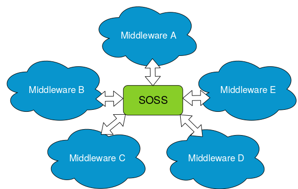
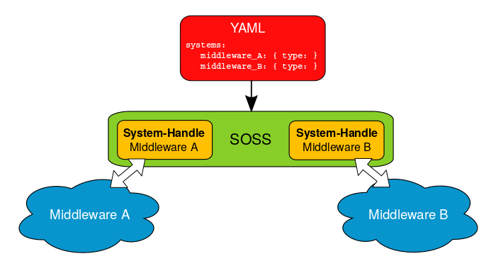

.. SOSS documentation master file.

SOSS Documentation
==================

.. image:: logo.png
    :height: 80px
    :width: 80px
    :align: left
    :alt: eProsima
    :target: http://www.eprosima.com/

*SOSS* is a *System-Of-Systems Synthesizer* that allows communication among an arbitrary number of protocols that
speak different languages.

If one has a number of complex systems and wills to combine them to create a larger, even more
complex system, *SOSS* can act as an intermediate message-passing tool that, by speaking a common
language, centralizes and mediates the integration.

The communication between the different protocols is made possible by system-specific plugins, or
**System-Handles**.
These provide the necessary conversion between the target protocols and the specific language
spoken by *SOSS*. Once a system is communicated with *SOSS*, it enters the *SOSS* world and can
straightforwardly reach out to any other system that already exists in this world.

*SOSS* is configured by means of a YAML text file, through which the user can provide a mapping between the topics and
services on the middlewares of the systems involved.

Main Features
^^^^^^^^^^^^^

*SOSS* provides a plugin-based platform that is easily and intuitively configurable.
This section explains these key features.

System Handles
--------------

A *SOSS* instance can connect *N* middlewares through dedicated plugins that speak the same
language as the core.
This common language is `eProsima xtypes <https://github.com/eProsima/xtypes>`__; a fast and lightweight
`OMG DDS-XTYPES standard <https://www.omg.org/spec/DDS-XTypes>`__ C++11 header-only implementation.
The plugins, or **System-Handles**, are discovered by *SOSS* at runtime
after they have been installed.

Built-in **System-Handles** are provided for the following systems: *DDS*, *Orion ContextBroker*, *ROS*, *ROS2*, and
*WebSocket*.
New **System-Handles** for additional protocols can be easily created, automatically allowing communication of the
new protocol with the middlewares that are already supported.
Detailed information on how to create a **System-Handle** can be found in the
:ref:`System-Handle Creation <system-handle creation>` section of this documentation.

The plugin-based framework is especially advantageous when it comes to integrating a new component into a complex
system where the rest of sub-systems use incompatible protocols.
Indeed, once all protocols of interest are communicated with *SOSS*, each via a dedicated
**System-Handle**, the integration is mediated by the core and relies on centralization rather than on the creation
of dedicated bridges for each pair of components.
For a system made of *N* components, this means that the number of new software parts to add grows as *N*
rather than *N²*.

YAML configuration files
------------------------

*SOSS* is configured by means of a YAML file.
Detailed information on how to configure a *SOSS*-mediated communication by means of one such file can be found in the
:ref:`YAML Configuration <yaml configuration>` section of this documentation.
Notice that a single YAML file is needed no matter how many protocols are being communicated.

Below you can find a minimal example of the information that this configuration text file should contain.
In this example, a single topic is translated from *ROS1* to *ROS2*:

.. code-block:: yaml

    systems:
        ros1: { type: ros1 }
        ros2: { type: ros2 }
    topics:
        chatter: { type: std_msgs/String, route: {from: ros1, to: ros2} }

The strength of this approach is that different translations are possible by only changing the configuration file.
For example, by changing
the middlewares involved, we can obtain an instance which translates between *WebSocket+JSON*
(as produced and consumed by a standard Web browser) and *ROS2*:

.. code-block:: yaml

    systems:
        web: { type: websocket_client, types-from: robot, host: localhost, port: 12345 }
        robot: { type: ros2 }
    routes:
        web2robot: {from: web, to: robot}
    topics:
        chatter: { type: "std_msgs/String", route: web2robot }

Additional features
-------------------

**Free and Open Source.**

*SOSS* and all **System-Handles** available to date are free and open source.

**Easily configurable.**

As detailed above, a *SOSS* instance is easily configurable by means of a YAML file.

**Easy to extend to new platforms.**

New platforms can easily enter the *SOSS* world by generating the plugin, or **System-Handle**
needed by the core to integrate them.

**Easy to use.**

Installing and running *SOSS* is intuitive and straightforward. Please refer to the
:ref:`Getting Started <getting started>` section to be guided through the installation process.

**Commercial support.**

Available at support@eprosima.com

Structure of the Documentation
^^^^^^^^^^^^^^^^^^^^^^^^^^^^^^

This documentation is organized into the following sections.

Installation Manual
-------------------

This section is meant to provide the user with an easy-to-use installation guide and is organized as follows:

.. toctree::
    :caption: Installation Manual

    external_dep
    getting_started

User Manual
-----------

This section provides the user with an in-depth knowledge of *SOSS*' main aspects. First of all,
we detail the internal structure of a **System-Handle** and guide the user through the creation a brand-new
**System-Handle**.
Secondly, we explain how to configure *SOSS* by means of YAML files, explaining how to fill the required fields,
depending on the needs of the specific use-case.

.. toctree::
    :caption: User Manual

    sh_creation
    yaml_config
