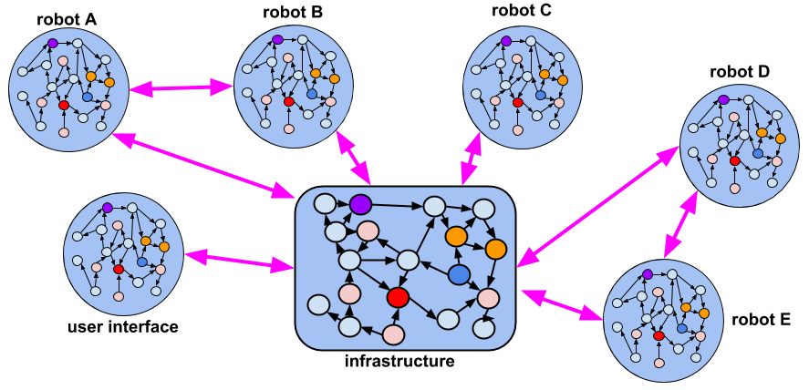
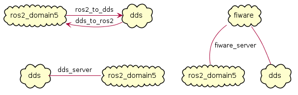
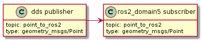
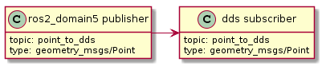
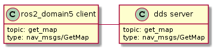
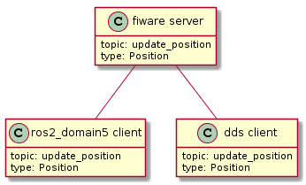
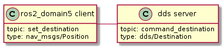

YAML Configuration
==================

*SOSS* is configured by means of a YAML file that specifies a set of compulsory fields, plus some optional ones.
The most common fields required to configure a **System-Handle** are:

* :code:`types`: specifies the IDL types used by *SOSS* to transmit messages
* :code:`systems`: specifies the middlewares involved in the communication
* :code:`routes`: specifies which bridges SOSS needs to create
* :code:`topics`/:code:`services`: specify the topics exchanged over the above bridges in either publisher/subscriber
  or client/server type communications

A generic YAML communicating two systems has the following structure:

.. code-block:: yaml

    types:
        idl: <idl_content>
        paths: [idl_include_path_1, id_include_path_2 ]
    systems:
        <system_1_name>: {
            type: <system_1_type>,
            types-from: <other_system_name>,
            <system_1_config>
        }
        <system_2_name>: {
            type: <system_2_type>,
            types-from: <other_system_name>,
            <system_2_config>
        }
    routes:
        <route_name>: { from: <system_1_name>, to: <system_2_name> }
        <service_route_name>: {
            server: <system_1_name>,
            client: [<system_2_name>, <other_system_name>]
        }
    topics:
        <topic_name>:
            type: <type_name>
            route: <route_name>
            remap:
                <system_1_name>: {
                    type: <type_remap_name>,
                    topic: <topic_remap_name>
                }
            <custom_topic_key>: <custom_topic_config>
    services:
        <service_name>:
            type: <type_service_name>
            route: <service_route_name>
            remap:
                system_2_name>: {
                    type: <type_remap_name>,
                    topic: <topic_name>
                }
            <custom_service_key>: <custom_service_config>

Here is a nontrivial example, which translates a number of topics and some
service clients between *WebSocket+Rosbridge_v2*, *ROS2*, and a (fictitious) automated door-opening
firmware:

.. code-block:: yaml

    systems:
        web: { type: websocket_server_json, types-from: ros2, port: 12345 }
        robot: { type: ros2 }
        door:
            type: veridian_dynamics_proprietary_door_firmware
            types-from: ros2
            serial: 1765TED

    routes:
        web2robot: {from: web, to: robot}
        robot2web: {from: web, to: robot}
        door_broadcast: {from: door, to: [web, robot]}
        web_service: {server: web, clients: robot}
        door_service: {server: door, clients: [web, robot]}

    topics:
        videocall_signalling_tx:
            type: "rmf_msgs/SignallingMessage"
            route: web2robot
        videocall_presence: { type: "std_msgs/String", route: web2robot }
        call_button_state_array:
            type: "rmf_msgs/CallButtonStateArray"
            route: robot2web
        videocall_signalling_rx:
            type: "rmf_msgs/SignallingMessage"
            remap: {
                robot:
                    type: {"videocall_signalling_rx/{message.message_to}" }
            }
            route: robot2web
        door_status:
            type: "rmf_msgs/DoorStatus"
            route: door_broadcast

    services:
        get_video_callers:
            type: "rmf_msgs/GetVideoCallers"
            route: web_service
        reserve_robot: { type: "rmf_msgs/ReserveRobot", route: web_service }
        release_robot: { type: "rmf_msgs/ReleaseRobot", route: web_service }
        open_door: { type: "rmf_msgs/OpenDoor", route: door_service }
        close_door: { type: "rmf_msgs/CloseDoor", route: door_service }

The idea is that each system plays some role in the overall system of systems, and the user needs to
specify the channels that these systems are expected to communicate over, as well as the direction
that information should flow over those channels. Topics can be many-to-many, one-to-many, or
many-to-one.
Additionally, service-client routes can be provided. Services must always designate one service provider, but may have
one or more clients.
Some systems may have a different name for a topic or a service, so the :code:`remap` dictionary allows the
config file to specify a different name that *SOSS* should use for each system.

Here is a diagram that illustrates the concept:

In the diagram, Robot A has a bunch of internal topics and services. It wishes
to export some (but not all) of them to a much larger collection of other
topics and services. In the process, some topic/service names will need to change,
and perhaps some other filtering will occur (for example, the rate of publishing
of its location will only be 1 Hz instead of 100 Hz, or its camera image will
be dramatically down-sampled, etc.). The *SOSS* configuration file will specify the
topics within Robot A that the robot needs to export, as well as what system
middlewares each exported topic needs to be forwarded to.

Types definition
^^^^^^^^^^^^^^^^

Some **System-Handles** have the ability to inform *SOSS* of the types definition
(using `XTypes <https://github.com/eProsima/xtypes>`__) that they can use.
The **System-Handles** of *ROS1* and *ROS2* are examples of this.
Nevertheless, there are cases where the **System-Handle** is not able to retrieve the type specification
(*websocket*, *mock*, *dds*, *fiware*, ...) that it needs for the communication.

In those cases, there are two ways to pass this information to the **System-Handle**:

- Using the :code:`types-from` property, that *imports* the types specification from another system.
- Specifying the type yourself by embedding an IDL into the YAML.

Regarding the second option, the IDL content can be provided in the YAML either directly, as follows:

.. code-block:: yaml

    types:
        idls:
            - >
                struct name
                {
                    idl_type1 member_1_name;
                    idl_type2 member_2_name;
                };

or by inclusion of a :code:`paths` field, that can be used to provide the preprocessor with a list of paths where
to search for IDL files to include into the IDL content. The syntax in this case would be:

.. code-block:: yaml

    types:
        idls:
            - >
                #include <idl_file_to_parse.idl>

            paths: [ idl_file_to_parse_path ]

Notice that these two approaches can be mixed.

The name for each type can be whatever the user wants, with the two following rules:

    1. The name cannot have spaces in it.
    2. The name must be formed only by letters, numbers and underscores.

Note: a minimum of a structure type is required for the communication.

For more details about IDL definition, please refer to
`IDL documentation <https://www.omg.org/spec/IDL/4.2/PDF>`__.

The following is an example of a full configuration defining a :code:`dds`-:code:`fiware` communication using the types
definition contained in the :code:`idls` block.

.. code-block:: yaml

    types:
        idls:
            - >
                struct Stamp
                {
                    int32 sec;
                    uint32 nanosec;
                };

                struct Header
                {
                    string frame_id;
                    stamp stamp;
                };

    systems:
        dds: { type: dds }
        fiware: { type: fiware, host: 192.168.1.59, port: 1026 }

    routes:
        fiware_to_dds: { from: fiware, to: dds }
        dds_to_fiware: { from: dds, to: fiware }

    topics:
        hello_dds:
            type: "Header"
            route: fiware_to_dds
        hello_fiware:
            type: "Header"
            route: dds_to_fiware

.. _TODO_1: Note that the publisher and subscriber in the DDS world need to be configured with a compatible IDL.
    That means that the type definition may differ between them.

.. _TODO_2: In that case, some `QoS policies <https://github.com/eProsima/xtypes#type-consistency-qos-policies>`__ will
    enable to try to convert the type. `soss` will notify the user with the different QoS policies enabled in
    the communication.

Systems definition
^^^^^^^^^^^^^^^^^^

A **System-Handle** may need additional configuration that should be defined in its :code:`systems` entry as a YAML map.
Each entry of this section represents a middleware involved in the communication, and corresponds to an instance of
a **System-Handle**.
All **System-Handles** accept the :code:`type` and :code:`types-from` options in their :code:`systems` entry.
If :code:`type` is omitted, the key of the YAML entry will be used as :code:`type`.

.. code-block:: yaml

    systems:
        dds:
        ros2_domain5: { type: ros2, domain: 5, node_name: "soss_5" }
        fiware: { host: 192.168.1.59, port: 1026 }

The snippet above will create three **System-Handles**:

* A *DDS* **System-Handle** or **SOSS-DDS** with default configuration.
* A *ROS2* **System-Handle** or **SOSS-ROS2** named :code:`ros2_domain` with :code:`domain = 5` and :code:`node_name = "soss_5"`.
* A *Fiware* **System-Handle** or **SOSS-FIWARE** with :code:`host = 192.168.1.59` and :code:`port = 1026`.

Currently, the following **System-Handles** are available for *SOSS*:

* **SOSS-DDS**: uses `Fast-RTPS <https://github.com/eProsima/Fast-RTPS>`_ to provide *DDS* compatibility.
* **SOSS-ROS2**: uses `ROS2 <https://github.com/ros2/ros2>`_ to allow access *ROS2* systems.
* **SOSS-ROS1**:uses `ROS <https://github.com/ros/ros>`_ to communicate with *ROS1* systems.
* **SOSS-MOCK**: echo-like system for testing purposes.
* **SOSS-FIWARE**: uses :code:`cURLpp` to communicate with *Fiware Orion Context-Broker* services.
* **SOSS-WEBSOCKET**: uses :code:`websocketpp` to interact with *WebSocket* services.
* **SOSS-SOMEIP**: uses :code:`vsomeip` to provide *SOME/IP* compatibility.

A new **System-Handle** can be created by implementing the desired :code:`SystemHandle` subclasses to
add support to any other protocol or system.
For more information consult the :ref:`System-Handle Creation <system-handle creation>` section.

Routes definition
^^^^^^^^^^^^^^^^^

This section allows enumerating the bridges between the systems that *SOSS* must manage.
To achieve bidirectional communication, both ways must be specified.

:code:`routes` definition keywords are specific depending on wether the route is
defining a *publisher/subscriber* path (:code:`from`-:code:`to`) or a *service/client* communication
path (:code:`server`-:code:`client`). For example:

.. code-block:: yaml

    routes:
        ros2_to_dds: { from: ros2_domain5, to: dds }
        dds_to_ros2: { from: dds, to: ros2_domain5 }
        dds_server: { server: dds, clients: ros2_domain5 }
        fiware_server: { server: fiware, clients: [ dds, ros2_domain5 ] }

This YAML defines the following routes:

* The route :code:`ros2_to_dds` defines a :code:`ros2_domain5` publisher with a :code:`dds` subscriber.
* The route :code:`dds_to_ros2` defines a :code:`dds` publisher with a :code:`ros2_domain5` subscriber.
* Having the routes :code:`ros2_to_dds` and :code:`dds_to_ros2` results in a bidirectional communication
  between the :code:`ros2_domain5` and :code:`dds` systems.
* The route :code:`dds_server` defines a :code:`dds` server with only one client: :code:`ros2_domain5`.
* The route :code:`fiware_server` defines a :code:`fiware` server with two clients: :code:`ros2_domain5` and
  :code:`dds`.

Topics definition
^^^^^^^^^^^^^^^^^

Each :code:`system` is able to *publish/subscribe* to each other’s :code:`topics`.
These *publish/subscription* policies are set directly in the YAML
configuration file by specifying the topic :code:`type` and its :code:`route` (which :code:`system` is
the publisher and which is the subscriber) as the main parameters:

.. code-block:: yaml

    topics:
        point_to_ros2:
            type: "geometry_msgs/Point"
            route: dds_to_ros2
        point_to_dds:
            type: "geometry_msgs/Point"
            route: ros2_to_dds

* The topic :code:`point_to_ros2` will create a :code:`dds` publisher and a :code:`ros2_domain5` subscriber.

* The topic :code:`point_to_dds` will create a :code:`ros2_domain5` publisher and a :code:`dds` subscriber.

If a custom **System-Handle** needs additional configuration regarding the :code:`topics`, it can
be added to the topic definition as new map entries.

Services definition
^^^^^^^^^^^^^^^^^^^

:code:`service` definition is very similar to :code:`topics` definition, with the difference that in this case
:code:`routes` can only be chosen among the ones specified with the *server/client*
syntax; also, the :code:`type` entry for these fields usually follows the *request/response*
model, pairing each of them with the corresponding :code:`route`, depending on
which :code:`system` acts as the server and which as the client(s).

.. code-block:: yaml

    services:
        get_map:
            type: "nav_msgs/GetMap"
            route: dds_server
        update_position:
            type: "Position"
            route: fiware_server

.. _comment_1: Once the branch "feature/dds_methods" is merged, add documentation about request and reply types.

* The service :code:`get_map` will create a :code:`dds` server and a :code:`ros2_domain5` client.

* The service :code:`update_position` will create a :code:`fiware` server, and :code:`dds` and :code:`ros2_domain5`
  clients.

If a custom **System-Handle** needs additional configuration regarding the :code:`services`, it can
be added in the service definition as new map entries.

Remapping
^^^^^^^^^

Sometimes, :code:`topics` or :code:`types` from one system are different from those managed by the systems with which
it is being bridged.
To solve this, *SOSS* allows to remap :code:`types` and :code:`topics`
in the *Topics definition* and in the *Services definition*.

.. code-block:: yaml

    services:
        set_destination:
            type: "nav_msgs/Position"
            route: dds_server
            remap:
                dds:
                    type: "dds/Destination"
                    topic: "command_destination"

In this :code:`services` entry, the :code:`remap` section defines the :code:`type` and the :code:`topic` that must be
used in the :code:`dds` system, instead of the ones defined by the service definition, which will be used by the
:code:`ros2_domain5` system.

